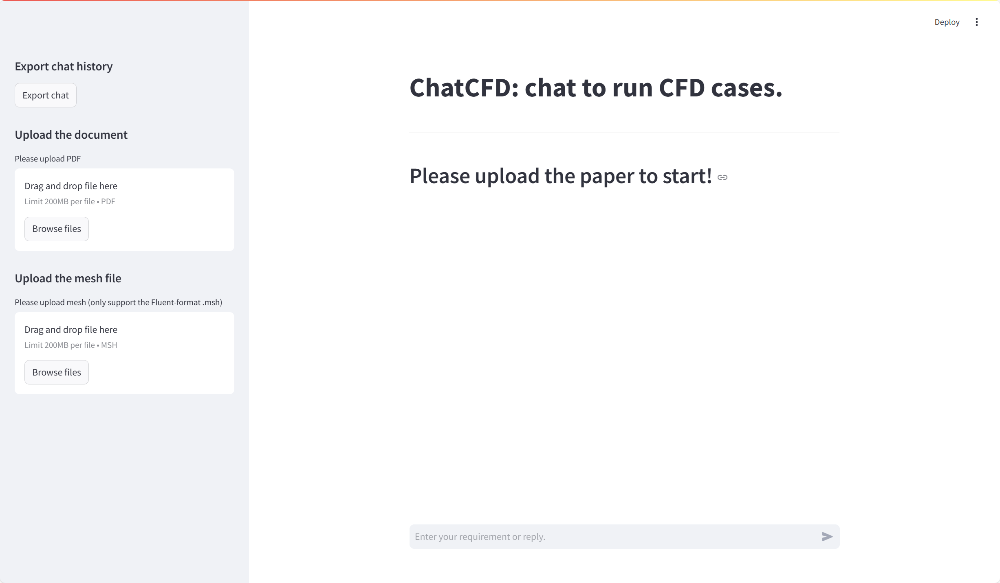

# 如何运行ChatCFD?

## Step 1. 配置环境 (需要测试)

通过yml文件创建环境

```
conda env create -f OA_env.yml  # it is chatcfd_env.yml before
```

验证关键组件
```
python -c "import faiss; print(faiss.IndexFlatL2(10))"  # 应输出向量索引对象
python -c "from PyFoam.RunDictionary.ParsedParameterFile import ParsedParameterFile; print('PyFoam OK')"
```


### 验证SentenceTransformer

Download the `BAAI/bge-base-en-v1.5` model using `test_env/download_model.py`

run the code `test_env/test_all_mpnet_base_v2.py` to make sure the SentenceTransformer is correctly set. A proper result might be:

```
GPU Available: False
GPU Name: None
Similarity 0-1: 0.383
Similarity 0-2: 0.182
```

If you have GPU, your result will be different.

## Step 2. 配置文件设置

配置文件 `inputs/chatcfd_config.json`

## Step 3. 运行前端界面

```
streamlit run src/main_run_chatcfd.py
```
运行成功后结果应该类似于


进入前端界面后该如何操作，我腾讯会议跟你说。